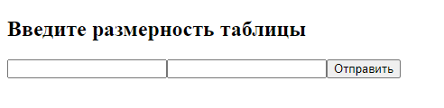
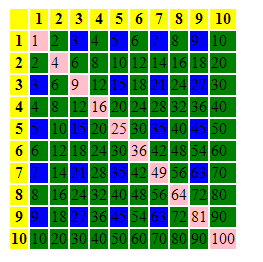

# PHP_multiplication_table
Вывод таблицы умножения заданной размерности

---

Требуется ввести размерность и нажать на кнопку

В результате выведется таблица умножения заданной размерности. 
* Фоновый цвет ячеек первой строки и первого столбца - желтый
* Фоновый цвет результирующих ячеек для ячеек содержащих четные значения - зеленый
* Фоновый цвет результирующих ячеек для ячеек содержащих нечетные значения - синий
* Если таблица квадратная, то элементы главной диагонали окрашены розовым

